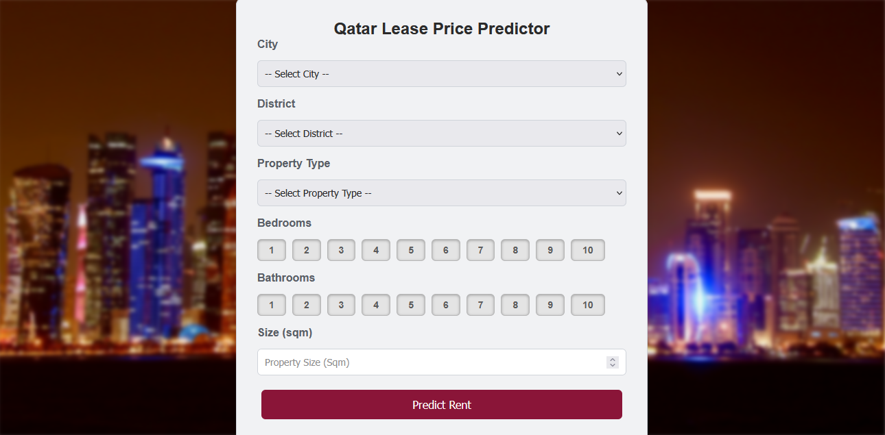
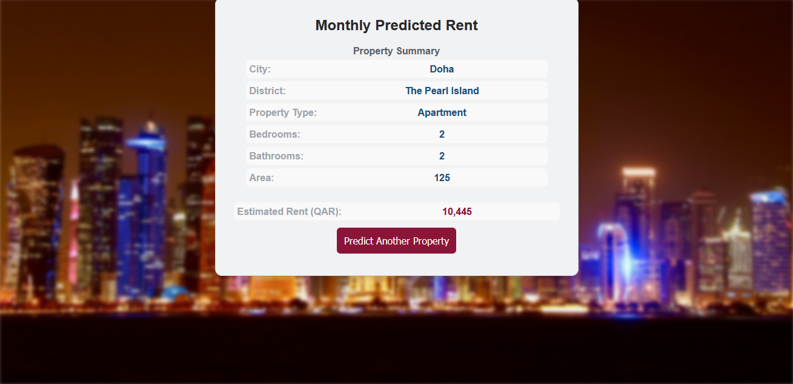

# Qatar Rent Price Prediction Web Application

This project is a web application that predicts rent prices in Qatar based on various property-related features. It combines **data analysis**, **machine learning modeling**, and a **Flask backend** with a responsive frontend built using **HTML, CSS, and JavaScript**.

---

## Live Demo

The application is deployed on an **AWS EC2 instance** and can be accessed here:

🔗 **Live App:** [Qatar Rent Predictor App](http://ec2-56-228-11-174.eu-north-1.compute.amazonaws.com/)

---

## Table of Contents

- [Project Overview](#project-overview)  
- [Features](#features)  
- [Technologies Used](#technologies-used)  
- [Installation](#installation) 
  
---

## Project Overview

The Rent Price Prediction Web Application allows users to enter property-related details including *city*, *district*, *property type*, *bedrooms*, *bathrooms* and *property size* in square meters and receive an estimated rental price in Qatari Riyal (QAR). 

The system is powered by a machine learning model trained on rental data from the month of August 2025. The data source can be viewed here: [Qatar Rental Properties Dataset](https://www.kaggle.com/datasets/mohamedsewid/qatar-rental-properties-market-dataset).

The application serves predictions through a **Flask backend**, which interacts with a **HTML/CSS/JavaScript frontend**.

---

## Features

- Predict rental prices based on user input.
- Interactive frontend for easy data input.
- Real-time predictions served via Flask.

---

## Technologies Used

- **Python** – Data wrangling, cleaning, machine learning, and backend logic.
- **Flask** – Backend server to handle HTTP requests and serve predictions.
- **HTML, CSS, JavaScript** – Frontend user interface.
- **Pandas, NumPy** – Data manipulation and analysis.
- **scikit-learn / Regression Models / XGBoost / Random Forest Regressor** – Machine learning models.

---

## Installation

1. **Clone the repository:**
```bash
git clone https://github.com/MohSalamh/Qatar-Rent-Predictor.git
cd Qatar-Rent-Predictor
```

2. **Create & Activate Virtual Environment (Windows)**
```bash
python -m venv venv
venv\Scripts\activate
```

3. **Install Dependencies**
```bash
pip install -r requirements.txt
```

4. **Run the Flask Backend**
```bash
python server.py
```
When the server starts, you should see this:
```bash
* Running on http://127.0.0.1:5000
```

5. **Access the Web App**
Open your browser and go to:
```bash
http://127.0.0.1:5000
```

